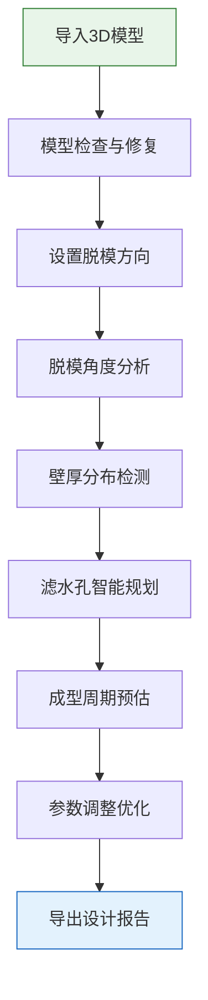

## 1. 产品概述

纸浆模塑模具设计辅助工具是一款面向纸浆模塑制品厂的专业设计软件，通过导入产品三维模型，自动完成脱模角度分析、壁厚分布检测、滤水孔智能布局和成型周期预估，帮助模具工程师大幅提升设计效率和产品质量。

- **核心价值**：将传统依赖经验的模具设计流程数字化、智能化，降低设计门槛，缩短产品开发周期
- **目标用户**：纸浆模塑制品厂的模具设计师、工艺工程师、技术主管
- **解决痛点**：人工计算脱模角度效率低、壁厚均匀性难以保证、滤水孔布局依赖经验、成型周期预估不准

## 2. 核心功能

### 2.1 用户角色
| 角色 | 登录方式 | 核心权限 |
|------|----------|----------|
| 设计师 | 本地应用直接使用 | 模型导入、分析计算、参数调整、结果导出 |

### 2.2 功能模块
1. **模型导入区**：支持 STL/OBJ 格式三维模型导入、模型预览与基础操作
2. **脱模角度分析**：自动计算各面脱模角度、标记不满足脱模要求的区域、可视化角度分布
3. **壁厚分布检测**：射线法计算壁厚分布、颜色映射显示厚薄区域、统计壁厚参数
4. **滤水孔规划**：基于壁厚和曲率智能推荐滤水孔位置、支持手动调整、导出孔位数据
5. **成型周期预估**：根据材料参数、壁厚、工艺条件预估成型周期、提供参数灵敏度分析

### 2.3 页面详情
| 页面名称 | 模块名称 | 功能描述 |
|-----------|-------------|---------------------|
| 主工作台 | 顶部导航栏 | 新建/打开项目、文件导入、导出报告、主题切换 |
| 主工作台 | 左侧工具栏 | 分析工具切换（脱模角度/壁厚/滤水孔/周期预估）、参数配置面板 |
| 主工作台 | 中央3D视图 | 模型渲染展示、分析结果可视化、交互操作（旋转/缩放/平移） |
| 主工作台 | 右侧信息面板 | 分析结果数据、统计图表、参数设置、报告生成 |
| 主工作台 | 底部状态栏 | 模型信息、操作提示、计算进度 |

## 3. 核心流程

用户从导入模型开始，依次进行脱模角度分析、壁厚检测、滤水孔规划和周期预估，每一步都可以调整参数并实时查看结果，最后导出完整的设计报告。

## 4. 用户界面设计

### 4.1 设计风格
- **主色调**：深空蓝 #0F172A 作为背景主色，搭配工业青 #06B6D4 作为强调色，营造专业科技感
- **辅助色**：警示橙 #F97316 用于标记问题区域，成功绿 #10B981 用于合格区域
- **字体**：使用 JetBrains Mono 作为数据显示字体，Inter 作为界面字体，体现工程软件的专业感
- **布局风格**：三栏式专业工具布局，左侧工具面板 + 中央视图区 + 右侧数据面板，深色主题为主
- **图标风格**：线性风格图标，简洁明了，符合工业软件的使用习惯

### 4.2 页面设计概述
| 页面名称 | 模块名称 | UI 元素 |
|-----------|-------------|----------|
| 主工作台 | 顶部导航栏 | 深色背景、品牌标识、功能菜单、操作按钮、悬停动效 |
| 主工作台 | 左侧工具栏 | 可折叠面板、工具图标列表、参数滑块、数值输入框 |
| 主工作台 | 3D视图区 | 全黑背景、网格地面、模型高光渲染、彩色热力图叠加、视角控制按钮 |
| 主工作台 | 右侧面板 | 标签页切换、数据卡片、统计图表、进度条、导出按钮 |
| 主工作台 | 底部状态栏 | 信息文字、分割线、状态指示灯 |

### 4.3 响应式
- 桌面端为主，最低支持 1440px 宽度
- 支持面板拖拽调整宽度
- 3D视图区自适应剩余空间

### 4.4 3D场景指导
- **环境**：深色工作室环境，柔和的全局光照，突出模型轮廓
- **光照设置**：三点光源（主光+补光+轮廓光），金属材质质感，边缘高光
- **相机设置**：透视相机，初始 45° 俯视角，支持轨道控制器
- **交互**：鼠标左键旋转、右键平移、滚轮缩放、双击重置视角
- **后处理**：轻微泛光效果、屏幕空间环境光遮蔽（SSAO）
- **性能**：模型面数控制在合理范围，分析计算使用 Web Worker 避免阻塞
