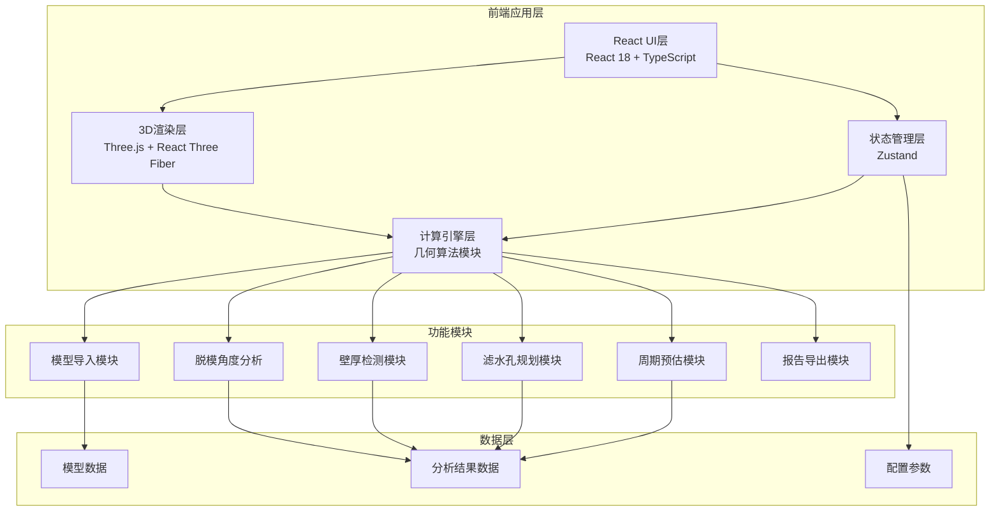

## 1. 架构设计

本项目为纯前端单页应用，采用 React + Three.js 技术栈实现专业级3D模具设计辅助工具。所有计算逻辑在浏览器端完成，无需后端服务。



## 2. 技术描述

- **前端框架**：React 18 + TypeScript 5 + Vite 5
- **3D渲染引擎**：Three.js 0.160 + @react-three/fiber 8 + @react-three/drei 9
- **后处理效果**：@react-three/postprocessing
- **样式方案**：TailwindCSS 3
- **状态管理**：Zustand 4
- **图表可视化**：recharts
- **模型加载**：three.js 内置 STL/OBJ 加载器
- **图标库**：lucide-react

## 3. 路由定义

| 路由 | 用途 |
|-------|---------|
| / | 主工作台页面，包含全部功能模块 |

## 4. 核心数据模型

### 4.1 类型定义

```typescript
// 模型数据
interface ModelData {
  id: string;
  name: string;
  vertices: Float32Array;
  faces: Uint32Array;
  normals: Float32Array;
  boundingBox: {
    min: { x: number; y: number; z: number };
    max: { x: number; y: number; z: number };
  };
}

// 脱模角度分析结果
interface DraftAngleResult {
  faceAngles: Float32Array;
  minAngle: number;
  maxAngle: number;
  avgAngle: number;
  undercutFaces: number[];
  draftDirection: { x: number; y: number; z: number };
  threshold: number;
}

// 壁厚分析结果
interface WallThicknessResult {
  samplePoints: { x: number; y: number; z: number; thickness: number }[];
  minThickness: number;
  maxThickness: number;
  avgThickness: number;
  thicknessDistribution: { range: string; count: number }[];
}

// 滤水孔数据
interface DrainHole {
  id: string;
  x: number;
  y: number;
  z: number;
  diameter: number;
  type: 'suction' | 'dewatering';
}

interface DrainHoleResult {
  holes: DrainHole[];
  totalCount: number;
  totalArea: number;
  recommendedDensity: number;
}

// 成型周期预估
interface MoldingCycleResult {
  totalTime: number;
  suctionTime: number;
  pressingTime: number;
  dryingTime: number;
  demoldingTime: number;
  parameters: {
    materialType: string;
    targetThickness: number;
    temperature: number;
    pressure: number;
  };
}
```

## 5. 项目结构

```
src/
├── components/          # UI组件
│   ├── layout/        # 布局组件
│   ├── panels/        # 面板组件
│   ├── viewer/        # 3D视图组件
│   └── charts/        # 图表组件
├── hooks/             # 自定义Hooks
├── store/             # Zustand状态管理
├── utils/             # 工具函数
│   ├── geometry/      # 几何计算算法
│   ├── analysis/      # 分析计算模块
│   └── models/        # 模型加载处理
├── types/             # TypeScript类型定义
├── pages/             # 页面组件
├── App.tsx
└── main.tsx
```

## 6. 核心算法说明

### 6.1 脱模角度计算
- 基于面法线与脱模方向的夹角计算
- 使用点积公式：angle = arccos(dot(normal, draftDir))
- 标记小于阈值的面为倒扣区域

### 6.2 壁厚检测
- 采用射线法：从表面点沿法线方向发射射线
- 计算射线与对面的交点距离作为壁厚
- 均匀采样策略保证计算效率

### 6.3 滤水孔规划
- 基于曲率分析确定平坦区域优先布孔
- 根据壁厚调整孔径大小
- 采用均匀分布算法保证孔间距合理

### 6.4 成型周期预估
- 基于经验公式：t = k * h^2 / D
- 考虑材料扩散系数、厚度、温度等因素
- 分阶段计算：吸浆、压制、干燥、脱模
